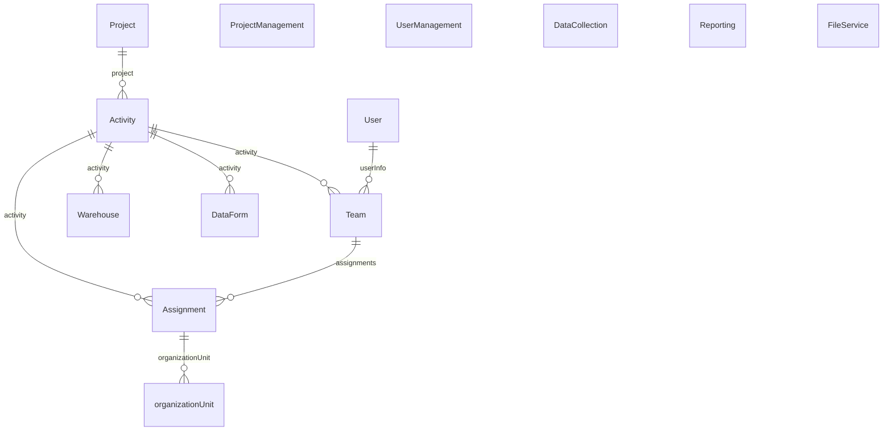
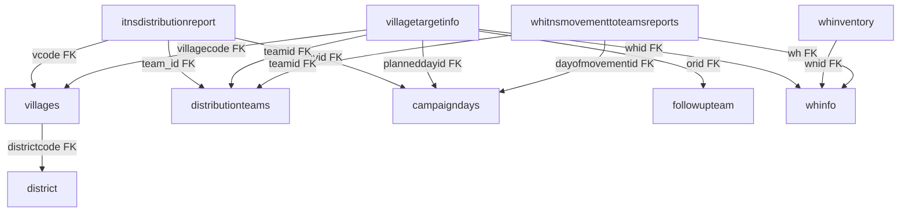
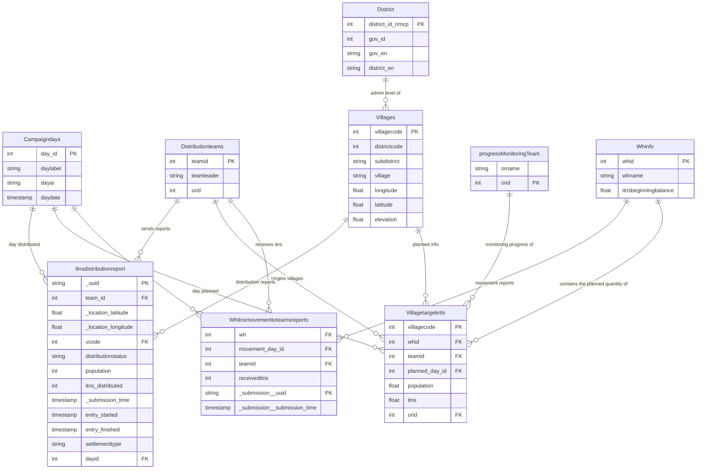

# DataRun System, NMCP Yemen

## 1. Introduction

### 1.1 Purpose

The purpose of this document is to provide a comprehensive overview of the DataRun, developed to manage activities and data for the National Malaria Control Program (NMCP). This document serves as a foundational reference for understanding its architecture, features, and functionalities. It is intended to facilitate the ongoing development, maintenance, and enhancement of DataRun, ensuring its effective implementation and integration with other health information systems.

### 1.2 Scope

This document is intended to cover DataRun in its entirety, including its design, architecture, key features, data management, database schema, user management, interoperability, security, user interface, workflow management, implementation details, and future enhancements. It provides detailed descriptions, diagrams, and visual aids to help stakeholders understand DataRun's components and their interactions.

*Note:* This site will serve as a centralized place where users can access up-to-date information, guides, and resources. This includes code snippets for interacting with the API; metadata descriptions; live integrations with other platforms and tools. It will evolve alongside DataRun, to ensure users can effectively leverage its capabilities. Stay tuned for regular updates as new features and improvements are added, visit [https://docs.nmcpye.org](https://docs.nmcpye.org).

### 1.3 Audience

The intended audience for this document includes:

- **End Users**: For understanding DataRun and how to use it.
- **Developers and Engineers**: For understanding the technical architecture and development requirements.
- **Project Managers and Coordinators**: For planning and overseeing the DataRun's deployment and usage.
- **Data Analysts and Researchers**: For utilizing the data collection and visualization tools.
- **System Administrators**: For managing and maintaining the DataRun's infrastructure and security.
- **Policy Makers and Stakeholders**: For evaluating the DataRun's effectiveness and integration with national health strategies.

## 2. DataRun Overview

### 2.1 DataRun Description

DataRun is an advanced information system designed to address the dynamic needs of the program's operations. It is designed mainly to support field Activities and streamlinining their data submission. DataRun adopts a modular architecture, allowing for the dynamic configuration and management of Organisation Units, Warehouses, projects, activities, teams, and assignments And intended to seamlessly integrate with other systems for health surveillance, information management, and service delivery.

**Modular and Scalable Architecture**

From its inception, DataRun was envisioned as a small but highly modular platform. This strategic decision allows us to build upon the core functionalities, enabling seamless integration of new features and capabilities as the program evolves. The modular design ensures that each component can operate independently while remaining interconnected, facilitating easy updates and expansions without disrupting existing operations.

### 2.2 Key Features

- **Modular Design**: DataRun's modular architecture separates activities, projects, teams, and assignments, promoting organization, scalability, and ease of future expansion.
- **Dynamic Data Management and Data Forms Creation:** Efficiently handle all information related to malaria cases, treatment protocols, and program activities. DataRun also allows the creation and configuration of data forms tailored to specific activities, ensuring relevant and accurate data collection.
- **Data Flow Management**: By specifying data entry and flow processes, DataRun enhances data integrity and traceability, critical for program monitoring and evaluation.
- **Data Collection**: Mobile and web supporting online and offline data collection in remote areas without internet connectivity, with a synchronization mechanism to upload data once connectivity is restored.
- **Data Visualization Tools**: Pivot tables, charts, and dashboards are included for effective data analysis and the generation of user-friendly reports to aid in decision-making.
- **Interoperability And Flexible Integration:** With its Open Architecture (API) it can easily integrate with other systems and databases supporting data interoperability with other health intervention areas (Eg. disease surveillance systems), quick and easy integration with existing platforms and systems such as supply chain, HRMS, LMIS, and DHIS2, ODK, facilitating coordination at scale ensuring a holistic approach to the program management.

**Future Growth**

As we move forward, the DataRun's modular foundation will allow us to introduce new functionalities and adapt to emerging needs. Whether it's integrating advanced analytics, enhancing user interfaces, or incorporating new data sources, DataRun is built to grow and evolve alongside the National Malaria Program. Its modularity ensures that it will continue to meet the program's needs, providing a reliable and scalable solution for years to come.

### 2.3 Objectives

The primary objectives of the DataRun are:

- **Enhance Data Management**: To improve the collection, processing, and storage of data related to NMCP activities.
- **Support Decision-Making**: To provide tools and reports that aid in informed decision-making for malaria control and prevention efforts.
- **Enable Field Data Collection**: To facilitate offline data collection in remote areas, ensuring comprehensive data capture regardless of internet connectivity.
- **Ensure Data Integrity**: To maintain high standards of data integrity and traceability through structured data flow management processes.
- **Enhance Intervention Planning**: Ability to reuse Activities data for planning and executing other activitiess leading to lower costs and lower turnaround time, leading to better estimation and planning.

## 3. Setting Up the Development Environment

This section provides a comprehensive guide to setting up the development environment for DataRun. The system comprises multiple repositories, each with specific dependencies and setup requirements. Follow the instructions below to get started.

### 3.1 Prerequisites

The build system will install automatically the recommended version of Node and npm.
- **Git**: For cloning repositories.
- **Docker**: For containerization.
- **Java (JDK 17+)**: For running Spring Boot applications.
- **Node.js (20.15)**: For the Angular front-end.
- **Flutter and Dart SDKs (>=3.3.0)**: For developing the mobile application and the mobile SDK.

### 3.2 Repository Setup

1. **data-run-api (Spring Boot, PostgreSQL, MongoDB)**

   - **Clone the Repository:**
     ```bash
     git clone https://github.com/MassPro-NMCPYE/data-run-api.git
     cd data-run-api
     ```
   - **Configure Application Properties:**
     Edit `src/main/resources/application-dev.yml` to match your database configurations:
     ```yml
     spring:
        # Mongodb Configuration
        data:            
            mongodb:
            uri: mongodb://localhost:27017/databaseName
            auto-index-creation: true

        # PostgreSQL Configuration
        datasource:
            url: jdbc:postgresql://localhost:5432/databaseName
            username: dbUsername
            password: dbPassword
     ```
   - **Run the Application:**
     ```bash
     ./mvnw
     ``` 

2. **data-run-front-end (Angular)**
   - **Clone the Repository:**
     ```bash
     git clone https://github.com/MassPro-NMCPYE/data-run-front-end.git
     cd data-run-front-end
     ```
   - **Install Dependencies:**
     ```bash
     npm install
     ```
   - **Configure API Endpoint:**
     Edit the environment file (`webpack/environment.js`) to point to the API:
     ```typescript
     module.exports = {
       I18N_HASH: 'generated_hash',
       SERVER_API_URL: '',
       __VERSION__: process.env.hasOwnProperty('APP_VERSION') ? process.env.APP_VERSION : 'DEV',
       __DEBUG_INFO_ENABLED__: false,
     };
     ```
   - **Run the Application:**
     ```bash
     ng serve
     ```

3. **data-run-mobile-sdk (Dart)**
   - **Clone the Repository:**
     ```bash
     git clone https://github.com/MassPro-NMCPYE/data-run-mobile-sdk.git
     cd data-run-mobile-sdk
     ```
   - **Install Dependencies:**
     ```bash
     dart pub get
     ```
4. **data-run-mobile-app (Flutter)**
   - **Clone the Repository:**
     ```bash
     git clone https://github.com/MassPro-NMCPYE/data-run-mobile.git
     cd data-run-mobile
     ```
   - **Install Dependencies:**
     ```bash
     flutter pub get
     ```
   - **Run the Application:**
     ```bash
     flutter run
     ```
   - **Configure API Endpoint:**
     Update the API endpoint in your Dart SDK configuration file `lib/commons/constants.dart`:
     ```dart
     const String apiUrl = 'http://localhost:8080';

5. **data-run-docs**
   - **Clone the Repository:**
     ```bash
     git clone https://github.com/MassPro-NMCPYE/data-run-docs.git
     cd data-run-docs
     ```
   - **Install MkDocs and mkdocs-materia:**
     ```bash
     pip install mkdocs
     pip install mkdocs-materia
     ```
   - **Serve the Documentation:**
     ```bash
     mkdocs serve
     ```

### 3.4 Building for production

#### 3.4.1 Packaging as jar

To build the final jar and optimize the dataRunApi application for production, run:

```
./mvnw -Pprod clean verify
```

To ensure everything worked, run:

```
java -jar target/*.jar
```

#### 3.4.2 Packaging as war

To package your application as a war in order to deploy it to an application server, run:

```
./mvnw -Pprod,war clean verify
```

### 3.5 Testing

#### Spring Boot tests

To launch your application's tests, run:

```
./mvnw verify
```

### 3.6 Using Docker to simplify development (optional)

You can use Docker to improve your development experience. A number of docker-compose configuration are available in the [src/main/docker](src/main/docker) folder to launch required third party services.

For example, to start a postgresql database in a docker container, run:

```
docker compose -f src/main/docker/postgresql.yml up -d
```

To stop it and remove the container, run:

```
docker compose -f src/main/docker/postgresql.yml down
```

to start a mongodb database in a docker container, run:

```
docker compose -f src/main/docker/mongodb.yml up -d
```

To stop it and remove the container, run:

```
docker compose -f src/main/docker/mongodb.yml down
```

You can also fully dockerize your application and all the services that it depends on.
To achieve this, first build a docker image of your app by running:

```
npm run java:docker
```

Or build a arm64 docker image when using an arm64 processor os like MacOS with M1 processor family running:

```
npm run java:docker:arm64
```

Then run:

```
docker compose -f src/main/docker/app.yml up -d
```

### 3.7 Cloud Setup (Google Cloud)

1. **Set Up Google Cloud Account:**
   - Sign up for a Google Cloud account and create a new project.

2. **Google Cloud SDK:**
   - Install the Google Cloud SDK on your local machine.
     ```bash
     curl https://sdk.cloud.google.com | bash
     exec -l $SHELL
     gcloud init
     ```

3. **Set Up Kubernetes Cluster:**
   - Create a Kubernetes cluster for container orchestration.
     ```bash
     gcloud container clusters create your-cluster-name
     ```

4. **Deploying Containers:**
   - Build Docker images for your services and push them to Google Container Registry.
     ```bash
     docker build -t gcr.io/your-project-id/data-run-api .
     docker push gcr.io/your-project-id/data-run-api
     ```
   - Deploy the images to your Kubernetes cluster using Kubernetes manifests.


## Example Workflows Diagrams and Visuals

**System Schema:**



**ITNs Campaign Graph**

ITNsCampaignsDB Graph Diagram:



### Deeper Dive into ITNs Projec workflow ERD

ITNsCampaignsDB ERD Diagram:



**Data Flow and Tracking:**

* **Campaign Planning:** `Campaigndays` define the campaign's timeline, while `Villagetargetinfo` captures planned ITN distribution for each village on specific days. This allows for precise planning and resource allocation.
* **Distribution Execution:** `Distributionteams` assigned to villages update `Itnsdistributionreport` with real-time data on distribution progress, including location details, population served, ITNs distributed, and status updates. This ensures transparency and accountability.
* **Monitoring and Evaluation:** `progressMonitoringTeam` tracks progress against targets through `Villagetargetinfo` and `Itnsdistributionreport` data. This enables timely interventions and adjustments to optimize campaign effectiveness.
* **Inventory Management:** `Whinfo` and `Whinventory` track ITN movement from warehouses to teams via `Whitnsmovementtoteamsreports`. This ensures accurate inventory control and prevents stockouts.

**Data Analysis and Insights:**

By combining data from various entities, the system can generate valuable insights:

* **Performance analysis:** Track ITN distribution progress across teams, districts, and villages, identifying areas requiring support or adjustments.
* **Efficiency evaluation:** Analyze time taken for ITN delivery, identify logistical bottlenecks, and optimize distribution routes.
* **Coverage assessment:** Ensure all target villages receive ITNs within the planned timeframe, minimizing missed populations.
* **Resource allocation:** Allocate resources like personnel and transportation efficiently based on real-time needs and progress data.

**Additional info about key entities:**

**Itnsdistributionreport:** This central entity serves as the treasure trove of campaign data, capturing crucial details about each ITN distribution instance. The `distributionstatus` provides an update on the progress (e.g., completed, pending), while `population` and `itns_distributed` figures quantify the impact. The `_submission_time` records the timing of data entry, and settlement type offers additional context when the report is about a refugee gathering in the distribution site.

**Villagetargetinfo:** This entity bridges the gap between villages and distribution plans. Each village record (villagecode) links to planned distribution details like the assigned warehouse (whid), responsible team (teamid), and planned distribution day (planneddayid). Target population and ITN figures (population and itns) guide resource allocation.

**Whitnsmovementtoteamsreports:** These reports capture the daily flow of ITNs from warehouses to distribution teams. Each report is uniquely identified by the involved warehouse (wh), day of movement (dayofmovementid), team (teamid). The `receiveditns` figures track the quantity of ITNs transferred, providing valuable insights into distribution efficiency and potential discrepancies. Finally, the submission details (_submission__uuid and_submission__submission_time) ensure data provenance and traceability.

**Warehouses:** We preplan warehouse locations for ITNs and allocate daily quantities needed for villages. Each day, teams retrieve allocated quantities from warehouses, covering villages in their planned path from the `villagetargetinfo` table. At day end, team leaders submit `itnsdistributionreport` for each village, marking it as 'Complete' if finished or 'In Progress' if not completed that day.

**Overall, this DB structure facilitates the analysis of various aspects of the campaign, enabling data-driven decision making. We can:**

* Identify teams or villages requiring additional support based on distribution performance.
* Analyze factors affecting distribution status and adjust strategies accordingly.
* Monitor progress against targets and make informed adjustments to campaign goals.
* Optimize resource allocation based on real-time data on team performance and inventory levels.

## Data-Run-Mobile

### Overview

Data-Run-Mobile is a Flutter application developed for the National Malaria Control Program (NMCP)
in Yemen. The app facilitates the submission and synchronization of malaria-related data with the
main backend system, Data-run-Api. This tool is designed to streamline data collection processes and
ensure accurate and timely data transmission to support malaria control efforts.

### Features

- **Dynamic Form Download**: The app downloads forms designed on the backend, which can include
  various question types.
- **Question Types**: Supports Text, Number, Date, Multi Answer, Single Answer, Image, and File
  questions.
- **Data Submission**: Users can submit various malaria-related data directly from the app.
- **Data Synchronization**: The app syncs submitted data with the Data-run-Api, ensuring all
  information is up-to-date.
- **User Authentication**: Secure login and authentication to ensure data integrity and privacy.
- **User Management**: Quickly create users and assign them to particular teams.
- **Offline Mode**: Allows data entry even when offline; data will be synced once the internet
  connection is restored.
- **User-Friendly Interface**: Simple and intuitive design to facilitate ease of use by healthcare
  workers.
-

### Screenshots

# Project Name

## Screenshots

|  |  |  |
| ----------------------- | ----------------------- |-------------------------|
|  |  |  |
|  |  |  |
|  |  |                         |


### Usage

1. **Login**: Enter your credentials to access the app.
2. **Download Forms**: Navigate to the forms section to download the latest forms from the backend.
3. **Data Entry**: Fill out the forms with the required data. The forms can include various types of
   questions:
    - **Text**: Enter textual information.
    - **Number**: Enter numerical data.
    - **Date**: Select dates from a date picker.
    - **Multi Answer**: Select multiple options from a list.
    - **Single Answer**: Select one option from a list.
    - **Image**: Capture or upload images.
    - **File**: Upload files.
4. **User Management**: Create users and assign them to specific teams.
5. **Sync Data**: Ensure your device is connected to the internet and use the sync feature to upload
   data to the Data-run-Api.
6. **View and Edit Submissions**: Check previous submissions and their sync status.

### Sample Form:

A sample of the form returned from the API end point:

```json
{
  "paging": true,
  "page": 0,
  "pageCount": 1,
  "total": 4,
  "pageSize": 20,
  "dataForms": [
    {
      "createdBy": "admin",
      "createdDate": "2024-08-05T02:37:40.535Z",
      "lastModifiedBy": "admin",
      "lastModifiedDate": "2024-08-05T02:37:40.535Z",
      "id": "66b03af41327d612461a6aac",
      "uid": "KcsA3KETRbY",
      "code": "CHV_PATIENTS_FORM",
      "displayName": "CHV cases registering form",
      "disabled": false,
      "activity": "oBne891mA9n",
      "version": 9,
      "defaultLocal": "en",
      "label": {
        "en": "CHV cases registering form",
        "ar": "تسجيل حالات chv"
      },
      "fields": [
        {
          "uid": "qR5sT6uV7W8",
          "code": null,
          "name": "locationName",
          "description": null,
          "type": "Text",
          "mandatory": true,
          "mainField": true,
          "rules": [
          ],
          "listName": null,
          "label": {
            "en": "Village Name",
            "ar": "اسم القرية"
          }
        },
        {
          "uid": "cD7eF8gH9I0",
          "code": null,
          "name": "name",
          "description": "Name of the patient",
          "type": "Text",
          "mandatory": true,
          "mainField": true,
          "rules": [
            {
              "uid": "eF6676iJ5K6",
              "field": "name",
              "expression": "name.length >= 9",
              "action": "Error",
              "message": {
                "en": "Name is not complete",
                "ar": "ادخل الاسم الرباعي"
              },
              "filterInfo": null
            }
          ],
          "listName": null,
          "label": {
            "en": "Patient name",
            "ar": "اسم المريض"
          }
        },
        {
          "uid": "vW3xY4zA5B6",
          "code": null,
          "name": "visitDate",
          "description": null,
          "type": "Date",
          "mandatory": true,
          "mainField": false,
          "rules": [
          ],
          "listName": null,
          "label": {
            "en": "Visit Date",
            "ar": "تاريخ الزيارة"
          }
        },
        {
          "uid": "jK1lM2nO3P4",
          "code": null,
          "name": "age",
          "description": "Age in Years and (months for age less than 1 year)",
          "type": "Age",
          "mandatory": true,
          "mainField": false,
          "rules": [
            {
              "uid": "eF66H6iJ5K6",
              "field": "age",
              "expression": "age <= 0 || age > 100",
              "action": "Error",
              "message": {
                "en": "Age is greater than normal",
                "ar": "العمر كبير جدا تأكد"
              },
              "filterInfo": null
            }
          ],
          "listName": null,
          "label": {
            "en": "Age",
            "ar": "العمر"
          }
        },
        {
          "uid": "xY9zA0bC1D2",
          "code": null,
          "name": "gender",
          "description": null,
          "type": "SelectOne",
          "mandatory": true,
          "mainField": false,
          "rules": [
          ],
          "listName": "genders",
          "label": {
            "en": "Gender",
            "ar": "الجنس"
          }
        },
        {
          "uid": "eF3gH4iJ5K6",
          "code": null,
          "name": "pregnant",
          "description": null,
          "type": "Boolean",
          "mandatory": true,
          "mainField": false,
          "rules": [
            {
              "uid": "eF5gH6iJ5K6",
              "field": "pregnant",
              "expression": "gender == 'FEMALE' && age >= 14",
              "action": "Show",
              "message": null,
              "filterInfo": null
            }
          ],
          "listName": null,
          "label": {
            "en": "Is pregnant?",
            "ar": "هل هي حامل؟"
          }
        },
        {
          "uid": "lM7nO8pQ9R0",
          "code": null,
          "name": "testResult",
          "description": null,
          "type": "SelectOne",
          "mandatory": true,
          "mainField": false,
          "rules": [
          ],
          "listName": "testResults",
          "label": {
            "en": "Test Result",
            "ar": "نتيجة الفحص"
          }
        },
        {
          "uid": "z33bC6dE7F8",
          "code": null,
          "name": "detectionType",
          "description": null,
          "type": "SelectOne",
          "mandatory": true,
          "mainField": false,
          "rules": [
            {
              "uid": "eF3gH8iJ5K9",
              "field": "detectionType",
              "expression": "testResult == 'PF' || testResult == 'PV' || testResult == 'MIX'",
              "action": "Show",
              "message": null,
              "filterInfo": null
            }
          ],
          "listName": "detectionTypes",
          "label": {
            "en": "Detection Type",
            "ar": "نوع الاكتشاف"
          }
        },
        {
          "uid": "zA5bDDdE7F8",
          "code": null,
          "name": "severity",
          "description": null,
          "type": "SelectOne",
          "mandatory": true,
          "mainField": false,
          "rules": [
            {
              "uid": "eF9gH8iJ5K9",
              "field": "severity",
              "expression": "testResult == 'PF' || testResult == 'PV' || testResult == 'MIX'",
              "action": "Show",
              "message": null,
              "filterInfo": null
            }
          ],
          "listName": "severities",
          "label": {
            "en": "Severity",
            "ar": "تصنيف الحالة"
          }
        },
        {
          "uid": "gH9iJ0kL1M2",
          "code": null,
          "name": "treatment",
          "description": null,
          "type": "SelectOne",
          "mandatory": true,
          "mainField": false,
          "rules": [
            {
              "uid": "gH99J1kL1M2",
              "field": "treatment",
              "expression": "pregnant && (testResult == 'PF' || testResult == 'PV' || testResult == 'MIX')",
              "action": "Filter",
              "message": null,
              "filterInfo": {
                "fieldToFilter": "treatment",
                "optionsToHide": [
                  "TREATED",
                  "FIRST_DOSE",
                  "FIRST_DOSE_REFERRAL"
                ],
                "optionsToShow": null
              }
            },
            {
              "uid": "gH1011kL1M2",
              "field": "treatment",
              "expression": "severity == 'SEVERE'",
              "action": "Filter",
              "message": null,
              "filterInfo": {
                "fieldToFilter": "treatment",
                "optionsToHide": null,
                "optionsToShow": [
                  "FIRST_DOSE_REFERRAL",
                  "REFERRAL"
                ]
              }
            },
            {
              "uid": "gH10J1kL1M2",
              "field": "treatment",
              "expression": "testResult == 'PF' || testResult == 'PV' || testResult == 'MIX'",
              "action": "Show",
              "message": null,
              "filterInfo": null
            }
          ],
          "listName": "treatments",
          "label": {
            "en": "Treatment",
            "ar": "تدبير الحالة"
          }
        },
        {
          "uid": "nO3pQ4rS5T6",
          "code": null,
          "name": "comment",
          "description": null,
          "type": "LongText",
          "mandatory": null,
          "mainField": false,
          "rules": [
          ],
          "listName": null,
          "label": {
            "en": "Comments",
            "ar": "ملاحظات وتعليقات"
          }
        }
      ],
      "options": [
        {
          "uid": "xY1200bC1D2",
          "form": null,
          "listName": "genders",
          "name": "FEMALE",
          "description": null,
          "order": 0,
          "label": {
            "en": "Female",
            "ar": "أنثى"
          }
        },
        {
          "uid": "5Y1200dC5D1",
          "form": null,
          "listName": "genders",
          "name": "MALE",
          "description": null,
          "order": 0,
          "label": {
            "en": "Male",
            "ar": "ذكر"
          }
        },
        {
          "uid": "688888BC7D1",
          "form": null,
          "listName": "testResults",
          "name": "INVALID",
          "description": null,
          "order": 0,
          "label": {
            "en": "Invalid",
            "ar": "غير صالح"
          }
        },
        {
          "uid": "6Y1288dC5D1",
          "form": null,
          "listName": "testResults",
          "name": "NEGATIVE",
          "description": null,
          "order": 0,
          "label": {
            "en": "Negative",
            "ar": "سلبي"
          }
        },
        {
          "uid": "6Y3338dC5D1",
          "form": null,
          "listName": "testResults",
          "name": "PF",
          "description": null,
          "order": 0,
          "label": {
            "en": "Plasmodium falciparum",
            "ar": "بلاسموديوم فالسيباروم"
          }
        },
        {
          "uid": "10CDF77C7D1",
          "form": null,
          "listName": "detectionTypes",
          "name": "ACTIVE",
          "description": null,
          "order": 0,
          "label": {
            "en": "Active",
            "ar": "بحث نشط"
          }
        },
        {
          "uid": "555288dC5D1",
          "form": null,
          "listName": "testResults",
          "name": "PV",
          "description": null,
          "order": 0,
          "label": {
            "en": "Plasmodium vivax",
            "ar": "بلاسموديوم فيفاكس"
          }
        },
        {
          "uid": "1CD8FEBC7D1",
          "form": null,
          "listName": "treatments",
          "name": "TREATED",
          "description": null,
          "order": 0,
          "label": {
            "en": "Treated",
            "ar": "معالج"
          }
        },
        {
          "uid": "10CDF8BC7D1",
          "form": null,
          "listName": "severities",
          "name": "SEVERE",
          "description": null,
          "order": 0,
          "label": {
            "en": "Severe",
            "ar": "وخيمة"
          }
        },
        {
          "uid": "9CC8F8BC7D1",
          "form": null,
          "listName": "severities",
          "name": "SIMPLE",
          "description": null,
          "order": 0,
          "label": {
            "en": "Simple",
            "ar": "بسيطة"
          }
        },
        {
          "uid": "666288dC5D1",
          "form": null,
          "listName": "testResults",
          "name": "MIX",
          "description": null,
          "order": 0,
          "label": {
            "en": "Mixed",
            "ar": "مختلط"
          }
        },
        {
          "uid": "9CC8F66C7D1",
          "form": null,
          "listName": "detectionTypes",
          "name": "REACTIVE",
          "description": null,
          "order": 0,
          "label": {
            "en": "Reactive",
            "ar": "زيارة روتينية"
          }
        },
        {
          "uid": "ECDYFEBC8D1",
          "form": null,
          "listName": "treatments",
          "name": "FIRST_DOSE",
          "description": null,
          "order": 0,
          "label": {
            "en": "First Dose",
            "ar": "الجرعة الأولى"
          }
        },
        {
          "uid": "ECDYF9628D1",
          "form": null,
          "listName": "treatments",
          "name": "FIRST_DOSE_REFERRAL",
          "description": null,
          "order": 0,
          "label": {
            "en": "First Dose & Referral",
            "ar": "الجرعة الأولى وإحالة"
          }
        },
        {
          "uid": "9RD8FEFC7D0",
          "form": null,
          "listName": "treatments",
          "name": "REFERRAL",
          "description": null,
          "order": 0,
          "label": {
            "en": "Referral",
            "ar": "إحالة"
          }
        }
      ],
      "orgUnits": [
        "...",
        "..."
      ]
    }
  ]
}

```
### Contributing

We welcome contributions to enhance Data-Run-Mobile. Please follow these steps:

1. Fork the repository.
2. Create a new branch (`git checkout -b feature-branch`).
3. Commit your changes (`git commit -m 'Add new feature'`).
4. Push to the branch (`git push origin feature-branch`).
5. Create a pull request.

## License

This project is licensed under the MIT License. See the [LICENSE](LICENSE) file for details.
