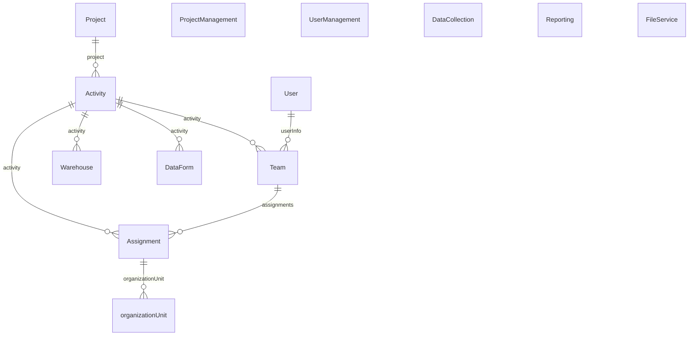

# DataRun System, NMCP Yemen

## 1. Introduction

### 1.1 Purpose

The purpose of this document is to provide a comprehensive overview of the DataRun, developed to manage activities and data for the National Malaria Control Program (NMCP). This document serves as a foundational reference for understanding its architecture, features, and functionalities. It is intended to facilitate the ongoing development, maintenance, and enhancement of DataRun, ensuring its effective implementation and integration with other health information systems.

### 1.2 Scope

This document is intended to cover DataRun in its entirety, including its design, architecture, key features, data management, database schema, user management, interoperability, security, user interface, workflow management, implementation details, and future enhancements. It provides detailed descriptions, diagrams, and visual aids to help stakeholders understand DataRun's components and their interactions.

*Note:* This site will serve as a centralized place where users can access up-to-date information, guides, and resources. This includes code snippets for interacting with the API; metadata descriptions; live integrations with other platforms and tools. It will evolve alongside DataRun, to ensure users can effectively leverage its capabilities. Stay tuned for regular updates as new features and improvements are added, visit [https://docs.nmcpye.org](https://docs.nmcpye.org).

### 1.3 Audience

The intended audience for this document includes:

- **End Users**: For understanding DataRun and how to use it.
- **Developers and Engineers**: For understanding the technical architecture and development requirements.
- **Project Managers and Coordinators**: For planning and overseeing the DataRun's deployment and usage.
- **Data Analysts and Researchers**: For utilizing the data collection and visualization tools.
- **System Administrators**: For managing and maintaining the DataRun's infrastructure and security.
- **Policy Makers and Stakeholders**: For evaluating the DataRun's effectiveness and integration with national health strategies.

## 2. DataRun Overview

### 2.1 DataRun Description

DataRun is an advanced information system designed to address the dynamic needs of the program's operations. It is designed mainly to support field Activities and streamlinining their data submission. DataRun adopts a modular architecture, allowing for the dynamic configuration and management of Organisation Units, Warehouses, projects, activities, teams, and assignments And intended to seamlessly integrate with other systems for health surveillance, information management, and service delivery.

**Modular and Scalable Architecture**

From its inception, DataRun was envisioned as a small but highly modular platform. This strategic decision allows us to build upon the core functionalities, enabling seamless integration of new features and capabilities as the program evolves. The modular design ensures that each component can operate independently while remaining interconnected, facilitating easy updates and expansions without disrupting existing operations.

### 2.2 Key Features

- **Modular Design**: DataRun's modular architecture separates activities, projects, teams, and assignments, promoting organization, scalability, and ease of future expansion.
- **Dynamic Data Management and Data Forms Creation:** Efficiently handle all information related to malaria cases, treatment protocols, and program activities. DataRun also allows the creation and configuration of data forms tailored to specific activities, ensuring relevant and accurate data collection.
- **Data Flow Management**: By specifying data entry and flow processes, DataRun enhances data integrity and traceability, critical for program monitoring and evaluation.
- **Data Collection**: Mobile and web supporting online and offline data collection in remote areas without internet connectivity, with a synchronization mechanism to upload data once connectivity is restored.
- **Data Visualization Tools**: Pivot tables, charts, and dashboards are included for effective data analysis and the generation of user-friendly reports to aid in decision-making.
- **Interoperability And Flexible Integration:** With its Open Architecture (API) it can easily integrate with other systems and databases supporting data interoperability with other health intervention areas (Eg. disease surveillance systems), quick and easy integration with existing platforms and systems such as supply chain, HRMS, LMIS, and DHIS2, ODK, facilitating coordination at scale ensuring a holistic approach to the program management.

**Future Growth**

As we move forward, the DataRun's modular foundation will allow us to introduce new functionalities and adapt to emerging needs. Whether it's integrating advanced analytics, enhancing user interfaces, or incorporating new data sources, DataRun is built to grow and evolve alongside the National Malaria Program. Its modularity ensures that it will continue to meet the program's needs, providing a reliable and scalable solution for years to come.

### 2.3 Objectives

The primary objectives of the DataRun are:

- **Enhance Data Management**: To improve the collection, processing, and storage of data related to NMCP activities.
- **Support Decision-Making**: To provide tools and reports that aid in informed decision-making for malaria control and prevention efforts.
- **Enable Field Data Collection**: To facilitate offline data collection in remote areas, ensuring comprehensive data capture regardless of internet connectivity.
- **Ensure Data Integrity**: To maintain high standards of data integrity and traceability through structured data flow management processes.
- **Enhance Intervention Planning**: Ability to reuse Activities data for planning and executing other activitiess leading to lower costs and lower turnaround time, leading to better estimation and planning.

## 3. Setting Up the Development Environment

This section provides a comprehensive guide to setting up the development environment for DataRun. The system comprises multiple repositories, each with specific dependencies and setup requirements. Follow the instructions below to get started.

### 3.1 Prerequisites

The build system will install automatically the recommended version of Node and npm.
- **Git**: For cloning repositories.
- **Docker**: For containerization.
- **Java (JDK 17+)**: For running Spring Boot applications.
- **Node.js (20.15)**: For the Angular front-end.
- **Flutter and Dart SDKs (>=3.3.0)**: For developing the mobile application and the mobile SDK.

### 3.2 Repository Setup

1. **data-run-api (Spring Boot, PostgreSQL, MongoDB)**

   - **Clone the Repository:**
     ```bash
     git clone https://github.com/MassPro-NMCPYE/data-run-api.git
     cd data-run-api
     ```
   - **Configure Application Properties:**
     Edit `src/main/resources/application-dev.yml` to match your database configurations:
     ```yml
     spring:
        # Mongodb Configuration
        data:            
            mongodb:
            uri: mongodb://localhost:27017/databaseName
            auto-index-creation: true

        # PostgreSQL Configuration
        datasource:
            url: jdbc:postgresql://localhost:5432/databaseName
            username: dbUsername
            password: dbPassword
     ```
   - **Run the Application:**
     ```bash
     ./mvnw
     ``` 

2. **data-run-front-end (Angular)**
   - **Clone the Repository:**
     ```bash
     git clone https://github.com/MassPro-NMCPYE/data-run-front-end.git
     cd data-run-front-end
     ```
   - **Install Dependencies:**
     ```bash
     npm install
     ```
   - **Configure API Endpoint:**
     Edit the environment file (`webpack/environment.js`) to point to the API:
     ```typescript
     module.exports = {
       I18N_HASH: 'generated_hash',
       SERVER_API_URL: '',
       __VERSION__: process.env.hasOwnProperty('APP_VERSION') ? process.env.APP_VERSION : 'DEV',
       __DEBUG_INFO_ENABLED__: false,
     };
     ```
   - **Run the Application:**
     ```bash
     ng serve
     ```

3. **data-run-mobile-sdk (Dart)**
   - **Clone the Repository:**
     ```bash
     git clone https://github.com/MassPro-NMCPYE/data-run-mobile-sdk.git
     cd data-run-mobile-sdk
     ```
   - **Install Dependencies:**
     ```bash
     dart pub get
     ```
4. **data-run-mobile-app (Flutter)**
   - **Clone the Repository:**
     ```bash
     git clone https://github.com/MassPro-NMCPYE/data-run-mobile.git
     cd data-run-mobile
     ```
   - **Install Dependencies:**
     ```bash
     flutter pub get
     ```
   - **Run the Application:**
     ```bash
     flutter run
     ```
   - **Configure API Endpoint:**
     Update the API endpoint in your Dart SDK configuration file `lib/commons/constants.dart`:
     ```dart
     const String apiUrl = 'http://localhost:8080';

5. **data-run-docs**
   - **Clone the Repository:**
     ```bash
     git clone https://github.com/MassPro-NMCPYE/data-run-docs.git
     cd data-run-docs
     ```
   - **Install MkDocs and mkdocs-materia:**
     ```bash
     pip install mkdocs
     pip install mkdocs-materia
     ```
   - **Serve the Documentation:**
     ```bash
     mkdocs serve
     ```

### 3.4 Building for production

#### 3.4.1 Packaging as jar

To build the final jar and optimize the dataRunApi application for production, run:

```
./mvnw -Pprod clean verify
```

To ensure everything worked, run:

```
java -jar target/*.jar
```

#### 3.4.2 Packaging as war

To package your application as a war in order to deploy it to an application server, run:

```
./mvnw -Pprod,war clean verify
```

### 3.5 Testing

#### Spring Boot tests

To launch your application's tests, run:

```
./mvnw verify
```

### 3.6 Using Docker to simplify development (optional)

You can use Docker to improve your development experience. A number of docker-compose configuration are available in the [src/main/docker](src/main/docker) folder to launch required third party services.

For example, to start a postgresql database in a docker container, run:

```
docker compose -f src/main/docker/postgresql.yml up -d
```

To stop it and remove the container, run:

```
docker compose -f src/main/docker/postgresql.yml down
```

to start a mongodb database in a docker container, run:

```
docker compose -f src/main/docker/mongodb.yml up -d
```

To stop it and remove the container, run:

```
docker compose -f src/main/docker/mongodb.yml down
```

You can also fully dockerize your application and all the services that it depends on.
To achieve this, first build a docker image of your app by running:

```
npm run java:docker
```

Or build a arm64 docker image when using an arm64 processor os like MacOS with M1 processor family running:

```
npm run java:docker:arm64
```

Then run:

```
docker compose -f src/main/docker/app.yml up -d
```

### 3.7 Cloud Setup (Google Cloud)

1. **Set Up Google Cloud Account:**
   - Sign up for a Google Cloud account and create a new project.

2. **Google Cloud SDK:**
   - Install the Google Cloud SDK on your local machine.
     ```bash
     curl https://sdk.cloud.google.com | bash
     exec -l $SHELL
     gcloud init
     ```

3. **Set Up Kubernetes Cluster:**
   - Create a Kubernetes cluster for container orchestration.
     ```bash
     gcloud container clusters create your-cluster-name
     ```

4. **Deploying Containers:**
   - Build Docker images for your services and push them to Google Container Registry.
     ```bash
     docker build -t gcr.io/your-project-id/data-run-api .
     docker push gcr.io/your-project-id/data-run-api
     ```
   - Deploy the images to your Kubernetes cluster using Kubernetes manifests.


**All System Schema:**

