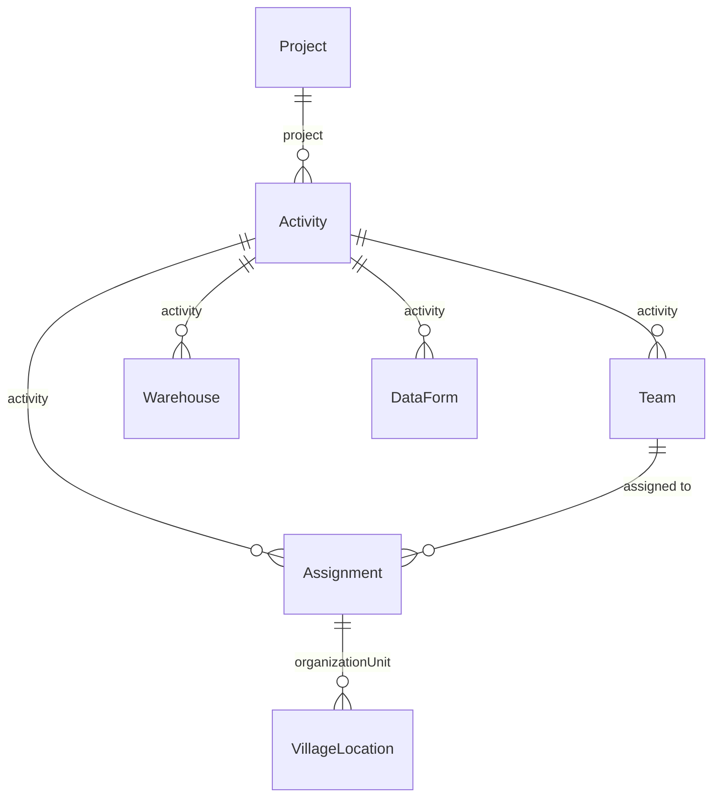
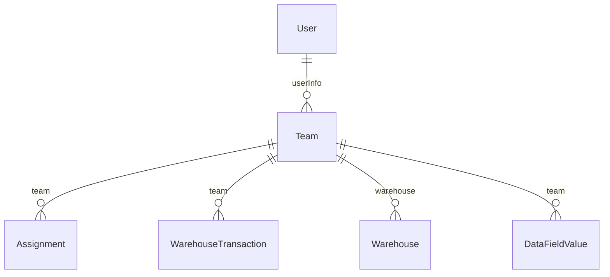
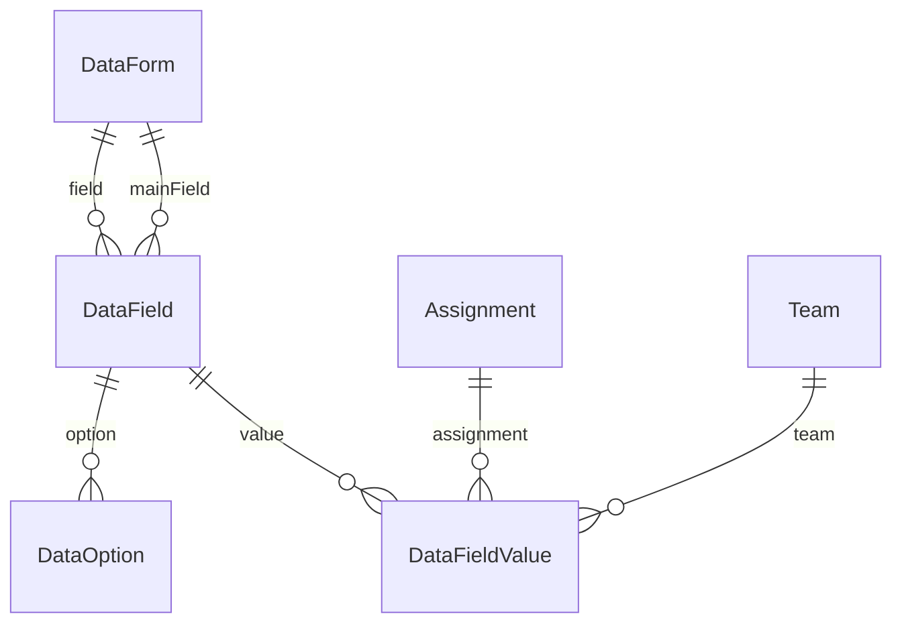
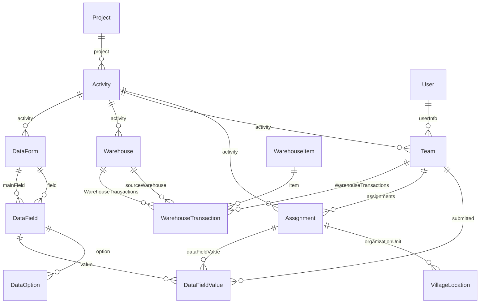

# Mass Pro System Report

**Project:** Information System for managing National Malaria Control Program Activities' and Data.

The report outlines a comprehensive Information System (IS) for managing National Malaria Control Program (NMCP) activities and data.

## Brainstorming

Projects: representing a boundary under which different activities can be defined and manged, A project might be a department that encapsulate their different activities. For Example:

Project 1: ITNs Project
 -> activity 1: ITNs Mass Distribution Campaign of 2020
 -> activity 2: ITNs Mass Distribution Campaign of 2021

Project 2: IRS Project
 -> activity 1: IRS Campaign of 2020
 -> activity 2: IRS Campaign of 2021

 Project 3: Community health Volunteers (CHVs) Project
 -> activity 1: CHV Routine Activity
 -> activity 2: Supervision Activity

Each Activity might has Multiple Teams, and Multiple Assignment each assignment assigned to a certain team, A team can be created and linked to a certain User.

Data Entry and Data Flow management:

- **DataForms:** can be designed and created dynamically with fields, fields configuration such as verification, show/hide logic... etc.

- an Activity can have multiple forms which the teams of that activity fetch and collect from the field during their assignment execution, example

  - **CHV Routine Activity Forms:**
    - Malaria Cases tests and Treatment Form, which used to enter the data a CHV visit or visits the chv.
    - Education Sessions Form: in which a CHV record and send the details of any Community Education and awareness session he conducts.
  
  - **ITNs Distribution Campaign of 2020:**
    - Form collecting the data of the ITNs Distribution for a certain village per house recorded and sent daily (Sent by Distribution Field teams based on the assigned location on the assignments).
    - Field's Warehouse Movement of ITNs: in which a Warehouse keeper (which is represented in the system as a team) records and sent the daily warehouse movement of ITNs from the warehouse to the `Distribution Field teams`.

It will have import export module.

Warehouse, Location, Team, Activity, Project and different entities in the system can be represented as Field in the Form.

**DataFormField:** has different valueTypes in addition to the common types (Integer, Text, Email, SelectOne, SelectMulti, YesNo, Boolean...etc), valueTypes also include (Activity, Team, Location, Assignment) in which they can be selected if a team is sending info related to certain entity in the system.

Locations, Health Facilities, Warehouses can be Called Master Entities which might be referenced and each managed in a certain module, for example

- In location Entities Module, Locations represented in one table, a tree like table, gov->district->village..., in this module maybe we can manage the locations population and the other related data to that location.
- Health Facility Module: I thought to include this in the locations module and call the locations OrganizationUnits, but I realized they have many management and reporting ways that are not shared with the locations so we thought of putting them in their own table.
- Warehouse Module: warehouses can have special management and reporting ways.

**The System would have:**

- UsersManagement capabilities, TeamsManagement capabilities, Assignments Management, Planning Management ...etc, maybe each gathered in a module.
- standard API that enables an easy connection and access to data.
- Mobile APP (Currently the data entry part).
- Frontend which is designed using angular to manage the different modules and parts of the system, it also has `Pivot Table module`, a `Charts module`, and a `Dashboard module`, the Dashboard module in which the display of charts or tables designed by `Pivot or Charts Modules` can be ordered and managed.

The system would implement different standards to make enterpropupulity easier with other systems.

System Features brainstorming:

- **Modular Design:** The modular architecture separates activities, projects, teams, and assignments, facilitating organization, scalability, and future expansion.
- **Dynamic Data Forms:**  The ability to create and configure forms dynamically allows for tailored data collection specific to each activity, ensuring data relevance.
- **Data Flow Management:**  Specifying data entry and data flow processes promotes data integrity and traceability, crucial for program monitoring and evaluation.
- **Offline Data Collection:**  A mobile app facilitates data collection in the field, even without internet connectivity, ensuring data capture regardless of network limitations, with a mechanism to synchronize collected data with the central server when internet connectivity becomes available, preventing data loss.
- **Data Visualization Tools:**  The inclusion of pivot tables, charts, and dashboards allows for effective data analysis and generation of user-friendly reports for informed decision-making.
- **Open Architecture (API):**  A standard API enables seamless data exchange with other health information systems, fostering interoperability and data integration.
- **Interoperability Standards:**  Implementing interoperability standards simplifies future integration with other systems, promoting a more connected health ecosystem.

**Suggestions for Improvement:**

- **Security Enhancements:**  The report doesn't explicitly mention security features. Implementing robust user authentication, authorization, and data encryption is crucial for protecting sensitive patient health information.
- **Granular User Roles and Permissions:**  Define user roles and permissions to control access to specific functionalities based on user profiles (e.g., healthcare worker, data analyst). This ensures data security and adherence to data governance principles.
- **Audit Trail Implementation:**  Implement audit trails to track user activity and data changes for accountability purposes and troubleshooting potential data integrity issues.
- **Integration with Mass Pro:**  The system is designed to accommodate workflow management functionalities. This might involve:
      ***Workflow Builder:**  A user interface where program administrators can define and configure workflows for different activities.
      ***Task Management:**  track assigned tasks, their status (pending, completed, overdue), and responsible personnel.
      ***Data Pre-population:**  pre-populate forms with relevant data based on the workflow context (e.g., beneficiary information during ITN distribution).
      ***Reporting:**  Generate reports to track workflow progress, identify bottlenecks, and measure overall efficiency.

diagram visualizing the structure of your database schema

**Project Management:**

**Team Management:**

**Data Entry:**

