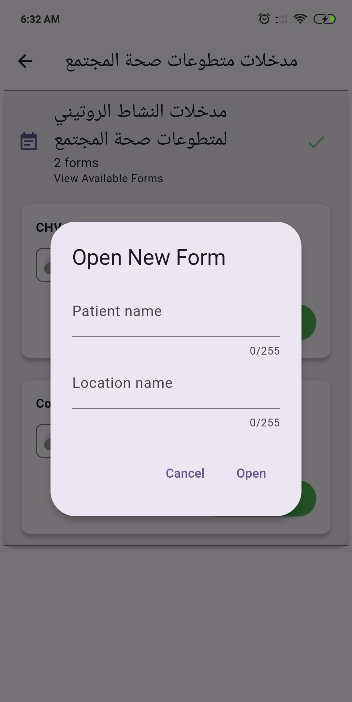
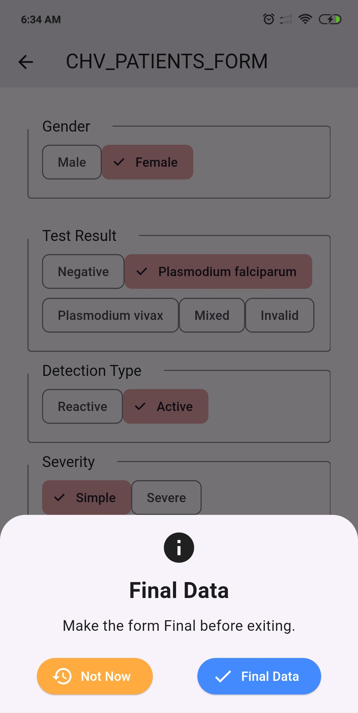
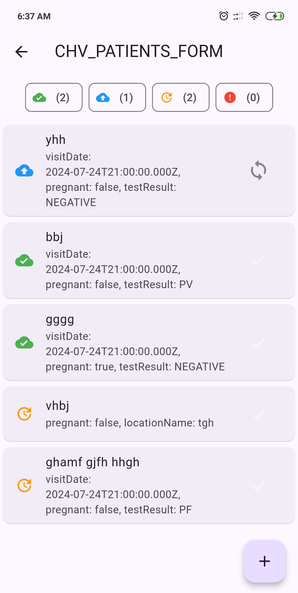

# Data-Run-Mobile

## Overview

Data-Run-Mobile is a Flutter application developed for the National Malaria Control Program (NMCP)
in Yemen. The app facilitates the submission and synchronization of malaria-related data with the
main backend system, Data-run-Api. This tool is designed to streamline data collection processes and
ensure accurate and timely data transmission to support malaria control efforts.

## Features

- **Dynamic Form Download**: The app downloads forms designed on the backend, which can include
  various question types.
- **Question Types**: Supports Text, Number, Date, Multi Answer, Single Answer, Image, and File
  questions.
- **Data Submission**: Users can submit various malaria-related data directly from the app.
- **Data Synchronization**: The app syncs submitted data with the Data-run-Api, ensuring all
  information is up-to-date.
- **User Authentication**: Secure login and authentication to ensure data integrity and privacy.
- **User Management**: Quickly create users and assign them to particular teams.
- **Offline Mode**: Allows data entry even when offline; data will be synced once the internet
  connection is restored.
- **User-Friendly Interface**: Simple and intuitive design to facilitate ease of use by healthcare
  workers.
-

## Screenshots

# Project Name

## Screenshots

|  |  |  |
| ----------------------- | ----------------------- |-------------------------|
|  |  |  |
|  |  |  |
|  |  |                         |


## Installation

To install Data-Run-Mobile on your device, follow these steps:

1. **Clone the Repository**:
   ```bash
   git clone https://github.com/Hamza-ye/datarun-mobile.git
   ```
2. **Navigate to the Project Directory**:
   ```bash
   cd data-run-mobile
   ```
3. **Install Dependencies**:
   ```bash
   flutter pub get
   ```
4. **Run the App**:
   ```bash
   flutter run
   ```

## Usage

1. **Login**: Enter your credentials to access the app.
2. **Download Forms**: Navigate to the forms section to download the latest forms from the backend.
3. **Data Entry**: Fill out the forms with the required data. The forms can include various types of
   questions:
    - **Text**: Enter textual information.
    - **Number**: Enter numerical data.
    - **Date**: Select dates from a date picker.
    - **Multi Answer**: Select multiple options from a list.
    - **Single Answer**: Select one option from a list.
    - **Image**: Capture or upload images.
    - **File**: Upload files.
4. **User Management**: Create users and assign them to specific teams.
5. **Sync Data**: Ensure your device is connected to the internet and use the sync feature to upload
   data to the Data-run-Api.
6. **View and Edit Submissions**: Check previous submissions and their sync status.

## Sample Form:

A sample of the form returned from the API end point:

```json
{
  "paging": true,
  "page": 0,
  "pageCount": 1,
  "total": 4,
  "pageSize": 20,
  "dataForms": [
    {
      "createdBy": "admin",
      "createdDate": "2024-08-05T02:37:40.535Z",
      "lastModifiedBy": "admin",
      "lastModifiedDate": "2024-08-05T02:37:40.535Z",
      "id": "66b03af41327d612461a6aac",
      "uid": "KcsA3KETRbY",
      "code": "CHV_PATIENTS_FORM",
      "displayName": "CHV cases registering form",
      "disabled": false,
      "activity": "oBne891mA9n",
      "version": 9,
      "defaultLocal": "en",
      "label": {
        "en": "CHV cases registering form",
        "ar": "تسجيل حالات chv"
      },
      "fields": [
        {
          "uid": "qR5sT6uV7W8",
          "code": null,
          "name": "locationName",
          "description": null,
          "type": "Text",
          "mandatory": true,
          "mainField": true,
          "rules": [
          ],
          "listName": null,
          "label": {
            "en": "Village Name",
            "ar": "اسم القرية"
          }
        },
        {
          "uid": "cD7eF8gH9I0",
          "code": null,
          "name": "name",
          "description": "Name of the patient",
          "type": "Text",
          "mandatory": true,
          "mainField": true,
          "rules": [
            {
              "uid": "eF6676iJ5K6",
              "field": "name",
              "expression": "name.length >= 9",
              "action": "Error",
              "message": {
                "en": "Name is not complete",
                "ar": "ادخل الاسم الرباعي"
              },
              "filterInfo": null
            }
          ],
          "listName": null,
          "label": {
            "en": "Patient name",
            "ar": "اسم المريض"
          }
        },
        {
          "uid": "vW3xY4zA5B6",
          "code": null,
          "name": "visitDate",
          "description": null,
          "type": "Date",
          "mandatory": true,
          "mainField": false,
          "rules": [
          ],
          "listName": null,
          "label": {
            "en": "Visit Date",
            "ar": "تاريخ الزيارة"
          }
        },
        {
          "uid": "jK1lM2nO3P4",
          "code": null,
          "name": "age",
          "description": "Age in Years and (months for age less than 1 year)",
          "type": "Age",
          "mandatory": true,
          "mainField": false,
          "rules": [
            {
              "uid": "eF66H6iJ5K6",
              "field": "age",
              "expression": "age <= 0 || age > 100",
              "action": "Error",
              "message": {
                "en": "Age is greater than normal",
                "ar": "العمر كبير جدا تأكد"
              },
              "filterInfo": null
            }
          ],
          "listName": null,
          "label": {
            "en": "Age",
            "ar": "العمر"
          }
        },
        {
          "uid": "xY9zA0bC1D2",
          "code": null,
          "name": "gender",
          "description": null,
          "type": "SelectOne",
          "mandatory": true,
          "mainField": false,
          "rules": [
          ],
          "listName": "genders",
          "label": {
            "en": "Gender",
            "ar": "الجنس"
          }
        },
        {
          "uid": "eF3gH4iJ5K6",
          "code": null,
          "name": "pregnant",
          "description": null,
          "type": "Boolean",
          "mandatory": true,
          "mainField": false,
          "rules": [
            {
              "uid": "eF5gH6iJ5K6",
              "field": "pregnant",
              "expression": "gender == 'FEMALE' && age >= 14",
              "action": "Show",
              "message": null,
              "filterInfo": null
            }
          ],
          "listName": null,
          "label": {
            "en": "Is pregnant?",
            "ar": "هل هي حامل؟"
          }
        },
        {
          "uid": "lM7nO8pQ9R0",
          "code": null,
          "name": "testResult",
          "description": null,
          "type": "SelectOne",
          "mandatory": true,
          "mainField": false,
          "rules": [
          ],
          "listName": "testResults",
          "label": {
            "en": "Test Result",
            "ar": "نتيجة الفحص"
          }
        },
        {
          "uid": "z33bC6dE7F8",
          "code": null,
          "name": "detectionType",
          "description": null,
          "type": "SelectOne",
          "mandatory": true,
          "mainField": false,
          "rules": [
            {
              "uid": "eF3gH8iJ5K9",
              "field": "detectionType",
              "expression": "testResult == 'PF' || testResult == 'PV' || testResult == 'MIX'",
              "action": "Show",
              "message": null,
              "filterInfo": null
            }
          ],
          "listName": "detectionTypes",
          "label": {
            "en": "Detection Type",
            "ar": "نوع الاكتشاف"
          }
        },
        {
          "uid": "zA5bDDdE7F8",
          "code": null,
          "name": "severity",
          "description": null,
          "type": "SelectOne",
          "mandatory": true,
          "mainField": false,
          "rules": [
            {
              "uid": "eF9gH8iJ5K9",
              "field": "severity",
              "expression": "testResult == 'PF' || testResult == 'PV' || testResult == 'MIX'",
              "action": "Show",
              "message": null,
              "filterInfo": null
            }
          ],
          "listName": "severities",
          "label": {
            "en": "Severity",
            "ar": "تصنيف الحالة"
          }
        },
        {
          "uid": "gH9iJ0kL1M2",
          "code": null,
          "name": "treatment",
          "description": null,
          "type": "SelectOne",
          "mandatory": true,
          "mainField": false,
          "rules": [
            {
              "uid": "gH99J1kL1M2",
              "field": "treatment",
              "expression": "pregnant && (testResult == 'PF' || testResult == 'PV' || testResult == 'MIX')",
              "action": "Filter",
              "message": null,
              "filterInfo": {
                "fieldToFilter": "treatment",
                "optionsToHide": [
                  "TREATED",
                  "FIRST_DOSE",
                  "FIRST_DOSE_REFERRAL"
                ],
                "optionsToShow": null
              }
            },
            {
              "uid": "gH1011kL1M2",
              "field": "treatment",
              "expression": "severity == 'SEVERE'",
              "action": "Filter",
              "message": null,
              "filterInfo": {
                "fieldToFilter": "treatment",
                "optionsToHide": null,
                "optionsToShow": [
                  "FIRST_DOSE_REFERRAL",
                  "REFERRAL"
                ]
              }
            },
            {
              "uid": "gH10J1kL1M2",
              "field": "treatment",
              "expression": "testResult == 'PF' || testResult == 'PV' || testResult == 'MIX'",
              "action": "Show",
              "message": null,
              "filterInfo": null
            }
          ],
          "listName": "treatments",
          "label": {
            "en": "Treatment",
            "ar": "تدبير الحالة"
          }
        },
        {
          "uid": "nO3pQ4rS5T6",
          "code": null,
          "name": "comment",
          "description": null,
          "type": "LongText",
          "mandatory": null,
          "mainField": false,
          "rules": [
          ],
          "listName": null,
          "label": {
            "en": "Comments",
            "ar": "ملاحظات وتعليقات"
          }
        }
      ],
      "options": [
        {
          "uid": "xY1200bC1D2",
          "form": null,
          "listName": "genders",
          "name": "FEMALE",
          "description": null,
          "order": 0,
          "label": {
            "en": "Female",
            "ar": "أنثى"
          }
        },
        {
          "uid": "5Y1200dC5D1",
          "form": null,
          "listName": "genders",
          "name": "MALE",
          "description": null,
          "order": 0,
          "label": {
            "en": "Male",
            "ar": "ذكر"
          }
        },
        {
          "uid": "688888BC7D1",
          "form": null,
          "listName": "testResults",
          "name": "INVALID",
          "description": null,
          "order": 0,
          "label": {
            "en": "Invalid",
            "ar": "غير صالح"
          }
        },
        {
          "uid": "6Y1288dC5D1",
          "form": null,
          "listName": "testResults",
          "name": "NEGATIVE",
          "description": null,
          "order": 0,
          "label": {
            "en": "Negative",
            "ar": "سلبي"
          }
        },
        {
          "uid": "6Y3338dC5D1",
          "form": null,
          "listName": "testResults",
          "name": "PF",
          "description": null,
          "order": 0,
          "label": {
            "en": "Plasmodium falciparum",
            "ar": "بلاسموديوم فالسيباروم"
          }
        },
        {
          "uid": "10CDF77C7D1",
          "form": null,
          "listName": "detectionTypes",
          "name": "ACTIVE",
          "description": null,
          "order": 0,
          "label": {
            "en": "Active",
            "ar": "بحث نشط"
          }
        },
        {
          "uid": "555288dC5D1",
          "form": null,
          "listName": "testResults",
          "name": "PV",
          "description": null,
          "order": 0,
          "label": {
            "en": "Plasmodium vivax",
            "ar": "بلاسموديوم فيفاكس"
          }
        },
        {
          "uid": "1CD8FEBC7D1",
          "form": null,
          "listName": "treatments",
          "name": "TREATED",
          "description": null,
          "order": 0,
          "label": {
            "en": "Treated",
            "ar": "معالج"
          }
        },
        {
          "uid": "10CDF8BC7D1",
          "form": null,
          "listName": "severities",
          "name": "SEVERE",
          "description": null,
          "order": 0,
          "label": {
            "en": "Severe",
            "ar": "وخيمة"
          }
        },
        {
          "uid": "9CC8F8BC7D1",
          "form": null,
          "listName": "severities",
          "name": "SIMPLE",
          "description": null,
          "order": 0,
          "label": {
            "en": "Simple",
            "ar": "بسيطة"
          }
        },
        {
          "uid": "666288dC5D1",
          "form": null,
          "listName": "testResults",
          "name": "MIX",
          "description": null,
          "order": 0,
          "label": {
            "en": "Mixed",
            "ar": "مختلط"
          }
        },
        {
          "uid": "9CC8F66C7D1",
          "form": null,
          "listName": "detectionTypes",
          "name": "REACTIVE",
          "description": null,
          "order": 0,
          "label": {
            "en": "Reactive",
            "ar": "زيارة روتينية"
          }
        },
        {
          "uid": "ECDYFEBC8D1",
          "form": null,
          "listName": "treatments",
          "name": "FIRST_DOSE",
          "description": null,
          "order": 0,
          "label": {
            "en": "First Dose",
            "ar": "الجرعة الأولى"
          }
        },
        {
          "uid": "ECDYF9628D1",
          "form": null,
          "listName": "treatments",
          "name": "FIRST_DOSE_REFERRAL",
          "description": null,
          "order": 0,
          "label": {
            "en": "First Dose & Referral",
            "ar": "الجرعة الأولى وإحالة"
          }
        },
        {
          "uid": "9RD8FEFC7D0",
          "form": null,
          "listName": "treatments",
          "name": "REFERRAL",
          "description": null,
          "order": 0,
          "label": {
            "en": "Referral",
            "ar": "إحالة"
          }
        }
      ],
      "orgUnits": [
        "...",
        "..."
      ]
    }
  ]
}

```
## Contributing

We welcome contributions to enhance Data-Run-Mobile. Please follow these steps:

1. Fork the repository.
2. Create a new branch (`git checkout -b feature-branch`).
3. Commit your changes (`git commit -m 'Add new feature'`).
4. Push to the branch (`git push origin feature-branch`).
5. Create a pull request.

## License

This project is licensed under the MIT License. See the [LICENSE](LICENSE) file for details.

## Contact

For questions or support, please contact:

- **Project Maintainer**: Hamza
- **Email**: 7amza.it@gmail.com
